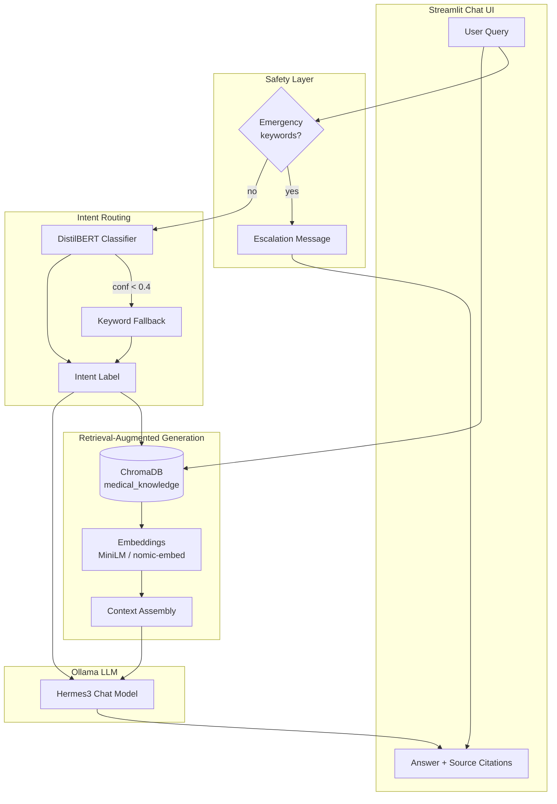
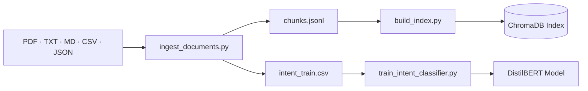

<div align="center">

<!-- Typing animation header -->
<a href="https://git.io/typing-svg">
  
</a>

<br />

<!-- Animated badge -->


<br /><br />

```
  __  __          _ _            _   _       _           _   
 |  \/  | ___  __| (_) ___ _ __ | |_(_) __ _| |__   ___ | |_ 
 | |\/| |/ _ \/ _` | |/ _ \ '_ \| __| |/ _` | '_ \ / _ \| __|
 | |  | |  __/ (_| | |  __/ | | | |_| | (_| | |_) | (_) | |_ 
 |_|  |_|\___|\__,_|_|\___|_| |_|\__|_|\__,_|_.__/ \___/ \__|
         Assistant Bot  ·  RAG  ·  DistilBERT  ·  Hermes
```

<sub>Web-based medical information chatbot — general health Q&amp;A with retrieval grounding, intent routing, and safety guardrails.</sub>

</div>

---

## Overview

This repository hosts an **academic NLP project** implementing a **Medical Assistant Bot** (Problem **D2**, Domain **D**). The system combines:

| Layer | Technology | Role |
|-------|------------|------|
| **UI** | [Streamlit](https://streamlit.io/) | Multi-turn chat, file upload, pipeline controls |
| **Intent** | [DistilBERT](https://huggingface.co/distilbert-base-uncased) | Route queries by medical intent |
| **Retrieval** | [ChromaDB](https://www.trychroma.com/) + embeddings | Ground answers in ingested documents |
| **Generation** | [Ollama](https://ollama.com/) (`hermes3`) | Transformer LLM for natural-language replies |

> **Disclaimer:** This bot provides **general medical information only**. It does **not** diagnose, prescribe, or replace professional healthcare. Emergency keywords trigger an immediate escalation message.

---

## Architecture



<details>
<summary><b>Data pipeline (offline)</b></summary>



</details>

---

## Features

| | Feature | Description |
|---|---------|-------------|
| 📄 | **Mixed document ingestion** | PDF, TXT, MD, CSV, JSON/JSONL with OCR/noisy-text cleaning |
| 🔍 | **Vector retrieval** | ChromaDB with `sentence-transformers` (default) or Ollama embeddings |
| 🧠 | **Intent classification** | 6 labels: `general_info`, `symptoms`, `medication`, `prevention`, `emergency`, `unknown` |
| 💬 | **Grounded generation** | Ollama Hermes3 with RAG context and configurable temperature |
| 🛡️ | **Safety guardrails** | Medical disclaimer, emergency detection, low-confidence fallback |
| 📎 | **Source citations** | Expandable source chunks with similarity scores in the UI |
| ⚡ | **Fast mode** | Smaller corpus + batch embeddings for quicker CPU iteration |

---

## Tech Stack

<p align="center">
  
  
  
  
  
  
  
  
</p>

---

## Project Structure

```
NLP THEORY CPC/
├── README.md                          ← you are here
├── requirements.txt                   ← shared Python dependencies
└── medical-assistant-bot/
    ├── app.py                         # Streamlit chat UI
    ├── config.yaml                    # Paths, Ollama, RAG, intent settings
    ├── data/
    │   ├── raw/                       # Your uploaded documents
    │   ├── sample/                    # Demo FAQ + articles
    │   ├── Datafile/                  # Tabular medical datasets
    │   └── processed/                 # chunks.jsonl, Chroma index
    ├── scripts/
    │   ├── ingest_documents.py
    │   ├── build_index.py
    │   └── train_intent_classifier.py
    ├── src/                           # RAG, Ollama client, intent, safety
    └── models/intent_classifier/      # Saved DistilBERT weights
```

---

## Quick Start

### 1. Prerequisites — Ollama (external or local)

```bash
ollama pull hermes3
ollama pull nomic-embed-text
ollama serve
```

Edit `medical-assistant-bot/config.yaml` and set `ollama.base_url` to your Ollama host (e.g. `http://192.168.1.10:11434`).

### 2. Python environment

```bash
cd medical-assistant-bot
python -m venv .venv
.venv\Scripts\activate        # Windows
# source .venv/bin/activate   # macOS / Linux
pip install -r ../requirements.txt
```

Place medical files in `data/raw/` (sample data is in `data/sample/`).

### 3. Run the pipeline

```bash
python scripts/ingest_documents.py
python scripts/build_index.py
python scripts/train_intent_classifier.py
streamlit run app.py
```

### Fast mode (CPU-friendly iteration)

Uses a smaller chatbot subset and batch `sentence-transformers` embeddings (~5–15 min index build vs 1–2 hours for the full corpus). Ollama is still used for chat at query time.

```bash
python scripts/ingest_documents.py --fast
python scripts/build_index.py --fast
python scripts/train_intent_classifier.py
streamlit run app.py
```

Or run the full fast pipeline in one step (PowerShell):

```powershell
.\run_pipeline_fast.ps1
```

Configure limits in `config.yaml`: `ingest.fast_max_chatbot_rows` (default `5000`) and `rag.embed_provider` (default `sentence-transformers`).

---

## Configuration Highlights

| Setting | Default | Purpose |
|---------|---------|---------|
| `ollama.chat_model` | `hermes3` | Primary LLM for chat |
| `ollama.fast_chat_model` | `qwen2.5:3b` | Faster alternative on CPU |
| `ollama.embed_model` | `nomic-embed-text` | Ollama embedding model |
| `rag.embed_provider` | `sentence-transformers` | Index-time embedding backend |
| `rag.embed_model` | `all-MiniLM-L6-v2` | Local embedding model |
| `rag.top_k` | `4` | Retrieved chunks per query |
| `rag.min_similarity` | `0.35` | Similarity threshold |
| `intent.model_name` | `distilbert-base-uncased` | Intent classifier backbone |

---

## Evaluation

| Metric | Value |
|--------|-------|
| Intent macro F1 | **0.78** |
| Intent accuracy | **0.97** |
| Training examples | 2,691 |
| Eval examples | 673 |

Emergency intent also uses **regex-based keyword detection** in the safety layer for immediate escalation regardless of classifier confidence.

---

## Assignment Alignment

| Requirement | Implementation |
|-------------|----------------|
| Conversational AI | Streamlit multi-turn chat with history |
| BERT | DistilBERT intent classifier (`distilbert-base-uncased`) |
| Transformer LLM | Ollama Hermes3 |
| Noisy text handling | PDF/OCR cleaning during ingest |
| Evaluation | Intent F1 metrics + RAG grounding via source citations |

---

## Troubleshooting

<details>
<summary><b>ImportError: <code>DEFAULT_EXCLUDED_CONTENT_TYPES</code> from <code>starlette.middleware.gzip</code></b></summary>

Newer Streamlit expects Starlette ≥ 0.41. Upgrade both packages inside your venv:

```powershell
pip install "streamlit>=1.40.0" "starlette>=0.41.0" --upgrade
```

Verify:

```powershell
streamlit --version
python -c "import streamlit"
```

</details>

<details>
<summary><b>First reply is very slow on CPU</b></summary>

The default `hermes3` model can take 2–5 minutes to load on first query. Switch to `qwen2.5:3b` via the Streamlit sidebar or set `ollama.fast_chat_model` in `config.yaml`.

</details>

---

<div align="center">

**Built for NLP Theory — Domain D2 Medical Assistant Bot**

<br />


</div>


## Suggested GitHub Topics

~~~text
python machine-learning ai
~~~

## License

This project is available under the MIT License. See [LICENSE](LICENSE).
