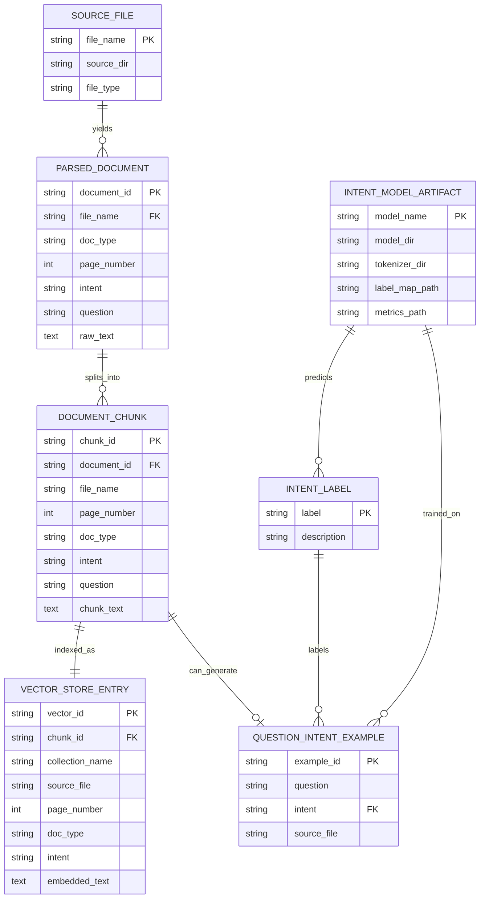

# Medical Assistant Bot ERD

This project is not backed by a traditional relational database. The diagram below is a **logical ERD** of the main data artifacts used by the pipeline: source files, parsed documents, chunks, intent training examples, vector-store entries, and the saved intent model.

## Notes

- `SOURCE_FILE` covers the mixed inputs handled by `scripts/ingest_documents.py`, including PDF, TXT, MD, CSV, JSON, and JSONL files.
- `PARSED_DOCUMENT` is the normalized form of a source file or page before chunking.
- `DOCUMENT_CHUNK` is what gets written to `data/processed/chunks.jsonl` and indexed into ChromaDB.
- `QUESTION_INTENT_EXAMPLE` is the deduplicated `question,intent` training data written to `data/processed/intent_train.csv`.
- `INTENT_LABEL` corresponds to the labels configured in `config.yaml`: `general_info`, `symptoms`, `medication`, `prevention`, `emergency`, and `unknown`.
- `VECTOR_STORE_ENTRY` represents the ChromaDB record created from each chunk, with metadata such as `source_file`, `page`, `doc_type`, and `intent`.
- `INTENT_MODEL_ARTIFACT` represents the saved DistilBERT classifier under `models/intent_classifier/` plus the generated metrics file.
- Streamlit chat session state (`messages` and `sources`) is runtime-only, so it is intentionally not shown here.
